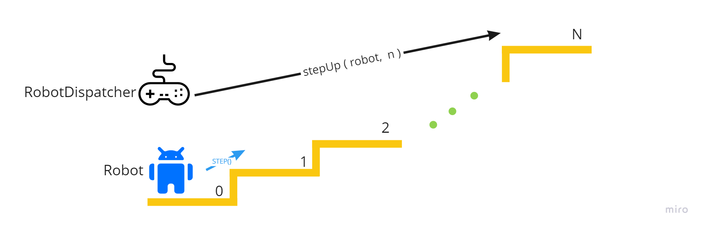

Робот и лестница
---



Задача: написать алгоритм функции `stepUp` в классе [RobotDispatcher](src/main/java/qa/task/RobotDispatcher.java), который позволит роботу дойти до указанной ступени.

### Главный метод `stepUp(Robot robot, int stepIndex)` (алгоритм этого методы нужно написать)

- На вход передается тестовый и работоспособный робот `robot`
- И индекс ступеньки `stepIndex`, до которой необходимо довести робота.

Вся логика должна быть в `stepUp`

Нужно оказаться ровно на той ступени `stepIndex` (начало с `0`), которая передана в методе - не больше, не меньше. А также не сломать робота.

У объекта `Robot` есть три функции, которые нужно использовать в алгоритме.

#### `boolean step()`

Попробовать подняться на одну ступень.

Но тут есть несколько ограничений:

- иногда у робота не выходит подняться и он падает на **ОДНУ** ступень вниз или **остается на нулевой** ступени, так как падать некуда
- метод вернет `true` если робот поднялся на одну ступень успешно.
- метод вернет `false` если робот упал на одну ступень вниз или остался на нулевой.
- у робота есть заряд и если мы попытаемся подняться, а заряда не будет, то робот сломается. Поэтому нужно иногда
  заряжать робота `charge()`
- на каждую попытку подняться (успешную и не успешную) робот теряет один заряд
- если робот `2 раза` подряд не смог подняться на ступень, то есть `step()` вернул `false` 2 раза **подряд**, то робота
  обязательно нужно почистить `clean()`

#### `charge()`

Зарядить робота на **1** заряд.

Изначально у робота **`10`** единиц заряда, то есть на **10** попыток подняться.

Но заряжать постоянно робота нельзя, если заряда станет **больше 10**, то робот сломается

Метод ничего не возвращает - просто заряжает робота.

#### `clean()`

Очистить колеса/ноги робота.

Если робот **`2 раза`** подряд не смог подняться на ступень, то есть `step()` вернул `false` 2 раза **подряд**, то робота
обязательно нужно почистить `clean()`

Но просто так чистить робота нельзя иначе он сломается.
Нужно чистить **ТОЛЬКО** если робот 2 раза не смог забраться на ступень, иначе он сломается!

Метод ничего не возвращает - просто чистит робота.

### Пример решения (неверного) на псевдо-языке
```
stepUp(Robot robot, int stepIndex) {

  charge = 5
  cleans = 2      

  цикл (от 0 до stepIndex)
    если (success != истина)
      то cleans = cleans - 1
    
    charge = charge - 1
        
    success = robot.step()
}
```

### Тестирование

Для проверки задания я скопирую ваш код или алгоритм себе и запущу тест `RobotDispatcherTest`. Если нужно сам переведу на нужный себе язык программирования.

Тест должен пройти успешно 5 раз для разных целевых ступеней.

Во время теста будет создан робот и запущен наш класс управления этим роботом и метод `stepUp` должен довести робота до цели. 

Важно, что нужно оказаться ровно на той ступени, которая передана в методе - не больше, не меньше.

:bangbang: :bangbang: Все задание и метод проверки описаны тут, уточняющие вопросы не принимаются. Создавать `MergeRequest` в этот репозиторий или делать `Fork` нельзя.
  